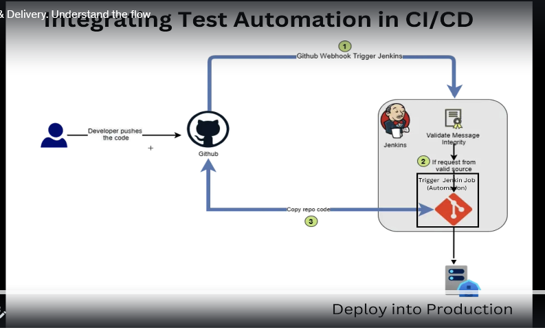

Website: https://rahulshettyacademy.com/client

User name anupama Kakkaragolla  
email ID: anupamakj@gmail.com  
password: Anupama@1214  

User name anupama anukj  
email ID: anupama@gmail.com  
password: Anupama@1214  

#### Steps to Install Maven ####
https://www.qamadness.com/knowledge-base/how-to-install-maven-and-configure-environment-variables/  

add folder path to the MAVEN_HOME file  
restart the terminal  

to check the maven version --> mvn -version 

#### maven testng integration ####
https://maven.apache.org/surefire/maven-surefire-plugin/examples/testng.html  

Using Suite XML Files  
Copy and paste in pom.xml file (under plugins) only plugin part

select on the project folder --> cmd to run --> mvn test -P(id)

mvn test -PRegression(id) -DBrowser=firefox

mvn test -PRegression -Dbrowser=firefox

#### Basic git commands ####
https://confluence.atlassian.com/bitbucketserver071/basic-git-commands-998653319.html

#### Integrating Test Automation in CI/CD ####
Continuous integration , Continuous delivery

to start jenkins
java -jar jenkins.war -httpPort=8080

