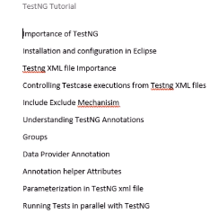

#### Test NG Learning ###########

1. Install TestNG from the Eclipse marketplace under help option

2. Need to @Test Annotation followed by methods

3. You can define multiple tests from single class

4. You can modularize the test cases based up on the functionality and trigger accordingly 

5. You can also get a control on running specific methods from test cases

#### How to create xml for the testNg

Click on the java project, right click --> TestNG --> covert to TestNG 

##### 
Test Suite --> Test Folder(Shell/Module Name) --> test cases
Under the class--> <Methods>
<Exclude>
<Include>
Partial Include/exclude methods using <exclude name="Mobile.*"/>
<Package>

#### Annotations
BeforeTest
AfterTest
These will executes per test in the XML  -> XML level

AfterSuite
Before Suite -> XML level

BeforeMethod
AfterMethod
These will execute per method in the class --> Class level

BeforeClass
AfterClass
Before and after executing any methods in the class --> Class level

Alphabetical order test cases will execute in TestNG

#### Groups in test NG ####

	  <groups>
		  <run>
			  <include name="Smoke"/>
		  </run>
	  </groups>
	  
Exclude also we can use  
	  
  @Test(groups= {"Smoke"}) --> need to add in the methods	  

@BeforeClass(alwaysRun=true)
From the testNG docs: alwaysRun For before methods (beforeSuite, beforeTest, beforeTestClass and beforeTestMethod, but not beforeGroups): If set to true, this configuration method will be run regardless of what groups it belongs to. For after methods (afterSuite, afterClass, ...): If set to true, this configuration method will be run even if one or more methods invoked previously failed or was skipped.

	@Test(dependsOnMethods= {"methods","methods"})
	
	@Test (enabled=false) for skipping test cases from execution
	
	@Test(timeOut=4000)for waiting a method
	
<parameter name="URL" value = "qaclickacadamy.com"/>

Test level parameterization and suite level parameterization  

Ex: 	@Parameters({"URL", "URLName"})  
	@Test  
	public void WebLoginCarLoan(String urlname, String key)  
	{  
		//selenium  
		System.out.println("WebLoginCar");  
		System.out.println(urlname); 
		System.out.println(key);  
	}  
	
