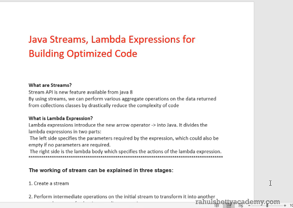
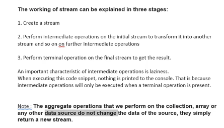

#### Java Streams 

There is life for intermediate op if there is no terminal operator 

terminal operator will execute only if intermediate op returns true

we can create stream

how to use filters in stream API